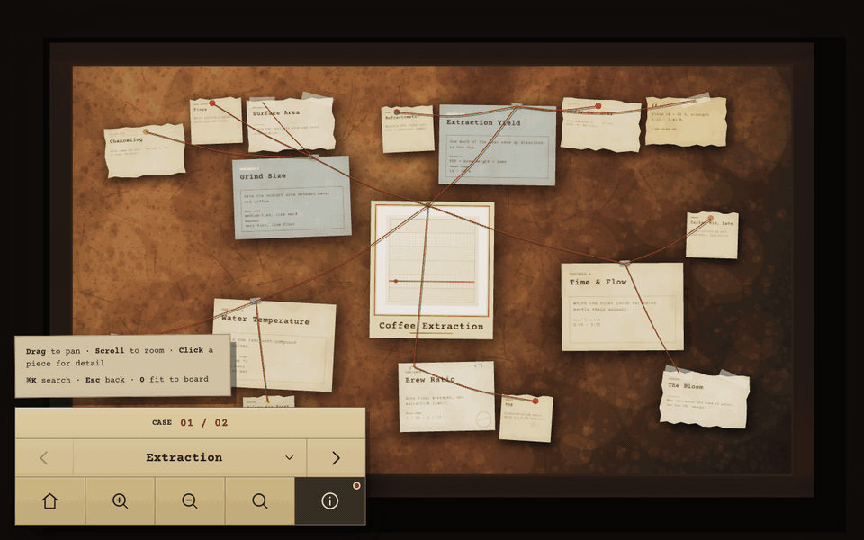

<h1 align="center">caseboard</h1>

<p align="center">
  <em>把任何主题钉上一块三维侦探证据板。</em>
</p>

<p align="center">
  
  
  
  
</p>

<p align="center">
  <sub><a href="README.md">English</a></sub>
</p>

---

<p align="center">
  <br>
  <sub>悬停光晕 → 聚焦卡片 → 方向键翻页 → ⌘K 搜索 → 回到全景 → 第二块案卷</sub>
</p>

一个 agent skill：把一个主题——一篇论文、一本书、一个技术栈、一段历史——拆成三层结构，钉上一块可交互的 WebGL 软木板：档案卡、撕边纸条、宝丽来、便利贴，红线连接父子关系，点开是黄色便签纸详情面板。

产出是自包含的 **Vite + three.js** 项目。全部内容在一份 JSON（`data/board.json`）里；其余一切——软木、木纹、纸纤维、16 种卡片的每一张脸——都是 Canvas 2D 运行时程序化画出来的。同一份 JSON 加同一个种子，逐位复现同一块板。

## 快速开始

在 Claude Code 里（skill 仅限用户显式调用，不会自动触发）：

```
/caseboard 咖啡萃取
/caseboard 把这篇论文整理成证据板：<粘贴内容>
```

在其他任意 coding agent 里：

```
读这个仓库的 caseboard SKILL.md，给我做一块关于咖啡萃取的板子
```

Agent 会先给出层级拆解方案，板子内容自动跟随你提问所用的语言（中文提问就是中文板子），确认后自动建项目、装依赖、把 `npm run check` 迭代到全绿，最后起好 dev server 直接给你 URL——全程不需要你敲命令。

| 操作 | 说明 |
|---|---|
| 拖拽 / 滚轮 | 平移 / 以光标为锚点缩放 |
| 点击纸片 | 打开详情面板，镜头飞向卡片 |
| `←` `→` | 面板打开时切换上一条 / 下一条 |
| `⌘K` / `Ctrl+K` | 搜索全部节点 |
| `Esc` / `0` | 关闭面板 / 回到全景 |

## 安装

丢给任意 coding agent：

```
Install the caseboard skill from https://github.com/Win-Hao/caseboard
```

或用 [skills CLI](https://github.com/vercel-labs/skills)（跨 agent）：

```bash
npx skills add Win-Hao/caseboard -g
```

Claude Code 以 plugin 安装（跟随仓库更新）：

```
/plugin marketplace add Win-Hao/caseboard
/plugin install caseboard@caseboard
```

手动（复制文件，钉死当前版本）：

```bash
git clone https://github.com/Win-Hao/caseboard.git
cp -R caseboard/skills/* ~/.claude/skills/   # Claude Code
cp -R caseboard/skills/* ~/.codex/skills/    # Codex
```

**claude.ai**：从 [Releases](https://github.com/Win-Hao/caseboard/releases) 下载 `caseboard.skill`，在 Settings → Capabilities 里上传（该包已去掉 Claude Code 专有的 frontmatter 字段）。

## 不经过 agent 直接跑 demo

自带数据是双案卷示例板（Coffee Extraction + Bread Fermentation，英文）：

```bash
cd skills/caseboard/assets/template
npm install
npm run dev     # 本地 URL 由 Vite 打印
npm run check   # 不开浏览器的验证，退出码 0 = 诊断全绿
npm run build   # 静态站输出到 dist/
```

## 设计要点

- **零图片资产**。软木、木纹、纸纤维、每张卡片全部 Canvas 2D 运行时生成，仓库不带任何贴图。
- **确定性**。布局、做旧斑点、图钉颜色全部由种子推导。排得不满意？改 `layout.seed`——换个字符串，整板重排。
- **不用看也能验证**。渲染器把覆盖率、重叠、出界、孤儿、文字溢出写进 DOM；`npm run check` 在 Node 里零依赖覆盖同一套合格线——agent 不看一个像素就能迭代到全绿。
- **边缘是真几何**。撕边、毛边、齿孔轮廓走 `ShapeGeometry`，不是 alpha 抠图——投影跟着轮廓走。
- **双语运行时**。界面语言、断行、字体回退跟随内容自动切换；中文内容就是中文界面，零配置。

## 仓库结构

skill 本体在 `skills/caseboard/`：

| 路径 | 是什么 |
|---|---|
| `SKILL.md` | 工作流：拆层级 → 选卡片 → 建项目 → 验证 → 交付 |
| `references/schema.md` | `board.json` 完整字段说明、16 种卡片、6 种边缘 |
| `references/example-board.json` | 17 节点范本，诊断全绿 |
| `references/materials.md` | 材质、纹理、光照参数表 |
| `references/contributing-a-card.md` | 加一种新卡片（两处改动 + 上手清单） |
| `assets/template/` | 复制到每个输出目录的项目模板 |

## License

[MIT](LICENSE)
